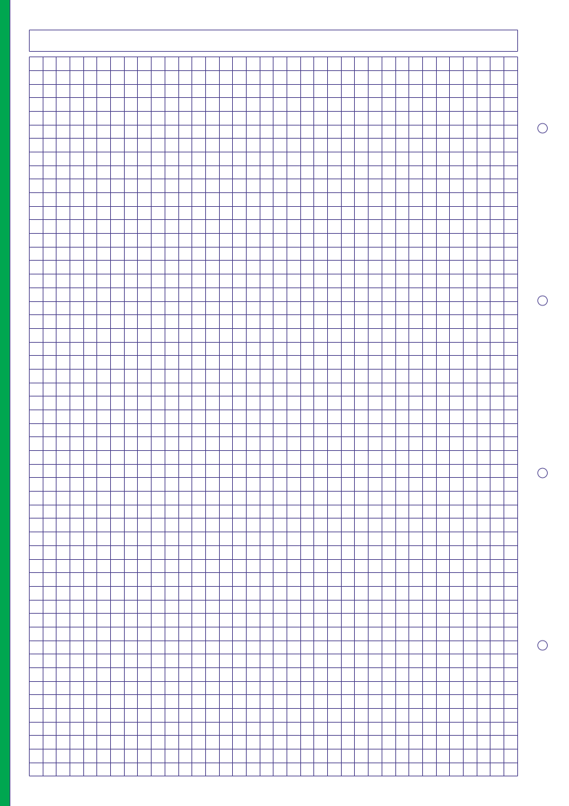

# pyPapermaker

**Status**: [Dev/Pre Alpha] 

## Overview
Exploratory program to demonstrate the use of reportlab
to generate high fidelity pdf stationery.

The script generates a customized page of graph paper as a pdf. 
(see images dir for example output).

 

Lines are automatically drawn onto a pdf canvas and a coloured
tab is drawn down the side of the page.

The colour can be customized by passing in the desired CMYK
values on the command line.

As a possible later enhancement a style can be passed via
the -s command line switch to enable other page designs to
be printed.

## Usage
NOTE: CLI TBD - in progress.
``` bash
python papermaker.py cyan, magenta, yellow, key 
                      -s style (default='squared'
                      -o file
                      -h 2 | 4
```
**Currently only 'squared' is implemented as a style.**
 
The image can be mirrored using Ghostscript to produce a front
and back printable page.

```bash
gs -o paper.pdf -sDEVICE=pdfwrite -dAutoRotatePages=/None \
   -c "<</Install{595 0 translate -1 1 scale}>>setpagedevice" \
   -f squared.pdf
```

An example of the produced pdf: 

[](images/squared.pdf)